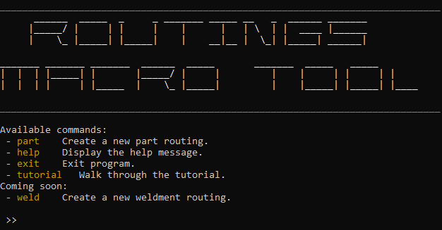
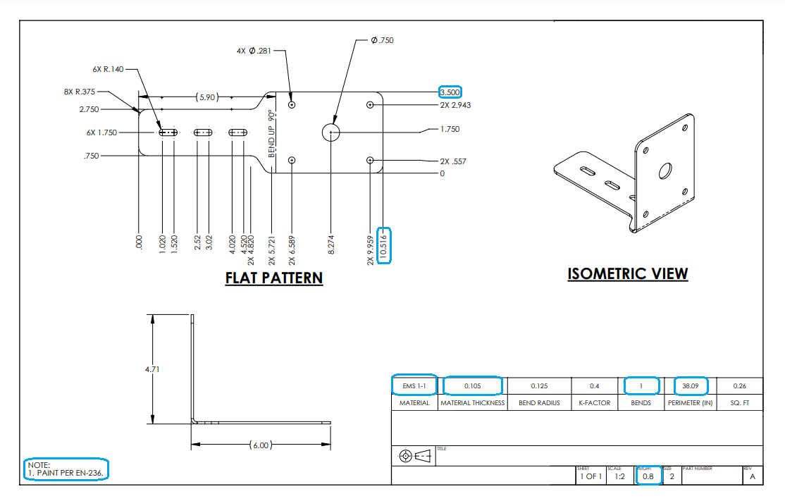

[![MIT License][license-shield]][license-url]
[![LinkedIn][linkedin-shield]][linkedin-url]


<!-- PROJECT HEADER -->
<br />
<div align="center">
    
</div>


<!-- TABLE OF CONTENTS -->
<details>
  <summary>Table of Contents</summary>
  <ol>
    <li><a href="#about-the-project">About The Project</a></li>
    <li><a href="#installation">Installation</a></li>
    <li><a href="#usage">Usage</a></li>
    <li><a href="#contributing">Contributing</a></li>
    <li><a href="#license">License</a></li>
    <li><a href="#contact">Contact</a></li>
  </ol>
</details>


<!-- ABOUT THE PROJECT -->
## About The Project

Before this project, each individual routing could over upwards of 12 minutes for a new engineer, and around 5 to 6 minutes for a more experienced engineer who has accumulated the necessary tribal knowledge.

**Now, it takes 30 seconds for an experienced engineer and under 2.5 minutes for someone new.**


What's different:
* Instead of collecting usages, cell codes, and locators from 3 different spreadsheets, everything can be calculated and entered directly from the print in one application.
* Parts can be updated directly - old routings deactivated and new routings entered in seconds.

Not all routings can be entered with this tool. The vast majority, however, are simple piece parts and weldments that can (and should) be quickly routed and located.

<p align="right">(<a href="#readme-top">back to top</a>)</p>


## Installation

_For co-ops/interns: It is recommended that you download and run `dist/main.exe`. However, if you do want to edit and/or build the source code:_

1. Clone the repo
   ```sh
   git clone https://github.com/dmalexa5/cli-route-locate
   ```
2. In `cli-route-locate`, build using `pyinstaller` or run directly (recommended)
   
   ```sh
   cli-route-locate\dist> ./cli-route-locate
   ```
   or
   ```sh
   pyinstaller -F src/main.py --name cli-route-locate
   ```


<p align="right">(<a href="#readme-top">back to top</a>)</p>

<!-- USAGE EXAMPLES -->
## Usage

```txt
Commands:
  part    Create a new part routing.
    l            Lasers
    e            Edgegrind
    b            Small Brake
    B            Large Brake
    P            Paint part
    s            Saw cut
    d            Drill and Tap

    i.e. >> part l e B P
            Starts the wizard for a large bent painted piece part

    -M, --macro    Runs the new part macro
    -U, --update   Runs the update existing part macro
    -L, --locator  Runs only the locator macro

    i.e. >> part -M l e B P

  help        Display this help message

  exit        Exit program

```

Say you are routing a standard piece part through the fabrication shop: (_Note: most of the information on this drawing is proprietary and has been erased._)

<a>
    
</a>

<br>

### Enter the circled information

```sh
>> part l e b P
      Enter material thickness: 0.105
      Enter material grade: EMS 1-1
      Enter part perimeter: 38.09
      Enter part shortest side: 3.5
      Enter part longest side: 10.516
      Enter number of bends: 1
      Enter weight of part being bent: 0.8
      Enter minimum paintable length: 3.5

```

### This should output your complete routing

```
┏━━━━━┳━━━━━━━━━━━┳━━━━━━━━━━━┳━━━━━━━┳━━━━━━━━━━━━━━━━━━━┓
┃ Seq ┃ Cell Name ┃ Machinist ┃ Usage ┃ Description       ┃
┡━━━━━╇━━━━━━━━━━━╇━━━━━━━━━━━╇━━━━━━━╇━━━━━━━━━━━━━━━━━━━┩
│ 10  │ 250001    │ MACHINIST │ 0.42  │ LASER CUT PART    │
│ 20  │ EDGEGRIND │ MACH OPER │ 0.63  │ GRIND EDGES       │
│ 30  │ 101001    │ MACHINIST │ 1.5   │ FORM BENDS        │
│ 40  │ 095424    │ PAINTER   │ 1.75  │ POWDER PAINT PART │
└─────┴───────────┴───────────┴───────┴───────────────────┘
```
If you used the `--macro` or `-M` options, enter your part number and locator, find the oracle routings item box, and press Ctrl + Shift + Right Arrow to activate the first third of the macro. After you click, hands off your keyboard!

Do the same things two more times, following the instructions.

You should see the following output in the command window, and (if done correctly) a full routing will automatically be entered into oracle.

```
Running macro: route_part...
Routing completed successfully.
Ctrl + Shift + Right Arrow in the Zoom -> Item Number box...

Running macro: enter_locator_pn...
Zoom -> Item Number complete.
Ctrl + Shift + Right Arrow in the POU locator box...

Running macro: enter_locator...
Locator complete.
 >>
```

Congratulations!! You've (hopefully) successfully entered a part routing into the fabrication system. I'd recommend manually checking this first one to make sure everything is right.

**Note: if the part already exists in Oracle, use the --update or -U option instead of --macro**

Weldments are the same. Getting the information is slightly more difficult.

<p align="right">(<a href="#readme-top">back to top</a>)</p>


<!-- CONTRIBUTING -->
## Contributing

Although this tool is very specific to one use case, any contributions you make are greatly appreciated! (Hint: future interns and co-ops...)

If you have a suggestion that would make this better, please fork the repo and create a pull request. You can also simply open an issue with the tag "enhancement".
Don't forget to give the project a star!

1. Fork the Project
2. Create your Feature Branch (`git checkout -b feature/AmazingFeature`)
3. Commit your Changes (`git commit -m 'Add some AmazingFeature'`)
4. Push to the Branch (`git push origin feature/AmazingFeature`)
5. Open a Pull Request

<p align="right">(<a href="#readme-top">back to top</a>)</p>

<!-- LICENSE -->
## License

Distributed under the MIT License. See `LICENSE.txt` for more information.

<p align="right">(<a href="#readme-top">back to top</a>)</p>


<!-- CONTACT -->
## Contact

David Alexander - [@dmalexa5](https://github.com/dmalexa5/)

Project Link - [https://github.com/dmalexa5/cli-macro-tool](https://github.com/dmalexa5/cli-macro-tool)

<p align="right">(<a href="#readme-top">back to top</a>)</p>

README template used from: [https://github.com/othneildrew/Best-README-Template/tree/main](https://github.com/othneildrew/Best-README-Template/tree/main)

<!-- MARKDOWN LINKS & IMAGES -->
<!-- https://www.markdownguide.org/basic-syntax/#reference-style-links -->
[license-shield]: https://img.shields.io/github/license/othneildrew/Best-README-Template.svg?style=for-the-badge
[license-url]: https://github.com/dmalexa5/cli-macro-tool/blob/main/LICENSE
[linkedin-shield]: https://img.shields.io/badge/-LinkedIn-black.svg?style=for-the-badge&logo=linkedin&colorB=555
[linkedin-url]: https://www.linkedin.com/in/dmalexa5/
